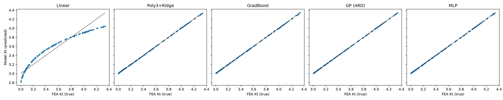
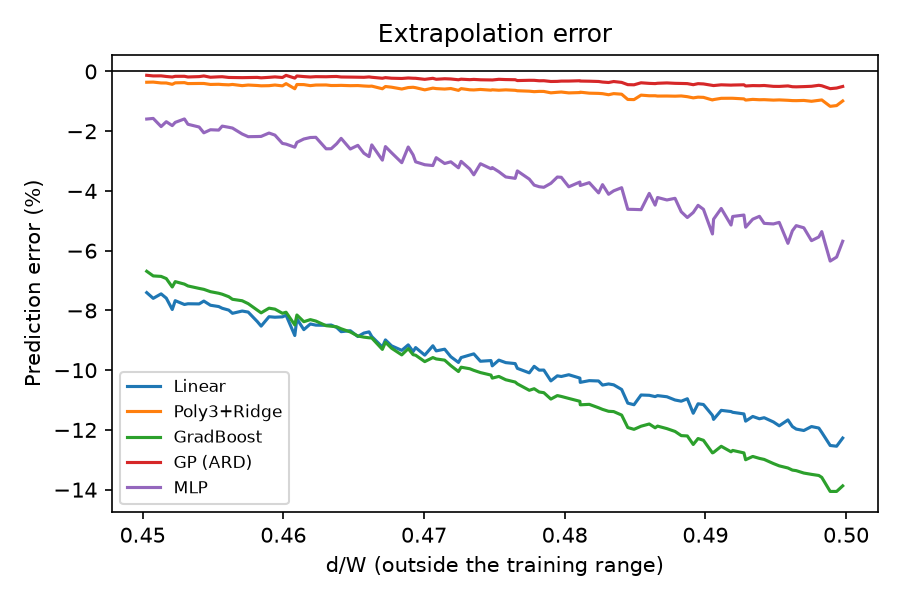
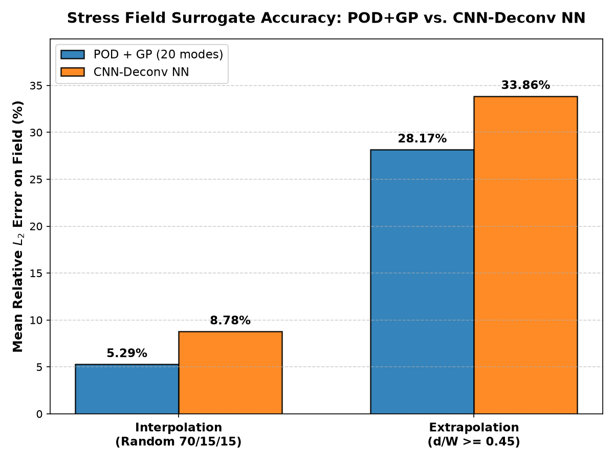
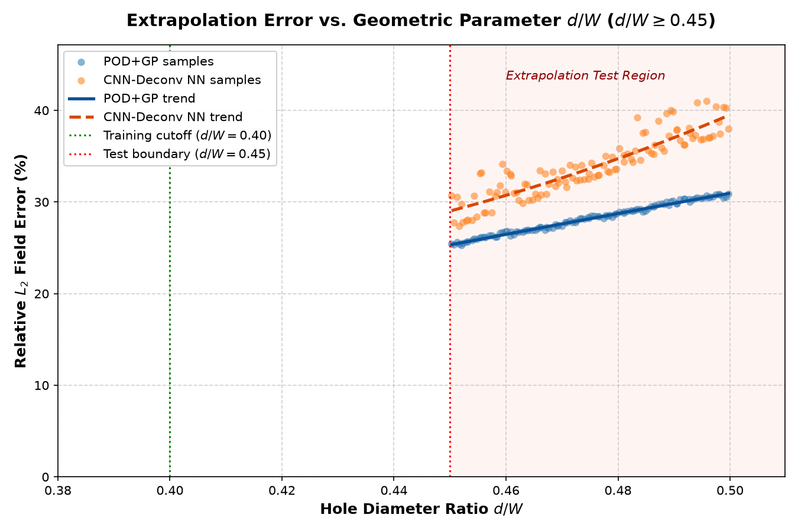
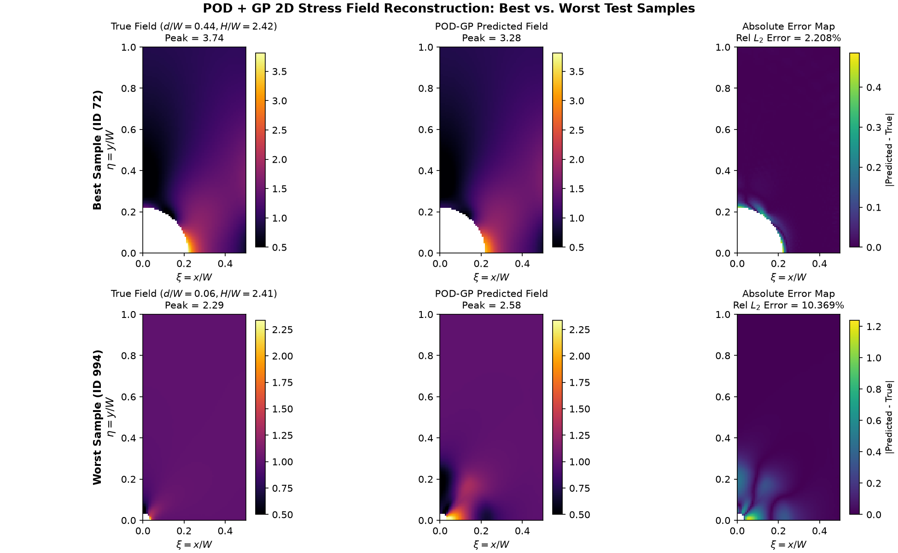
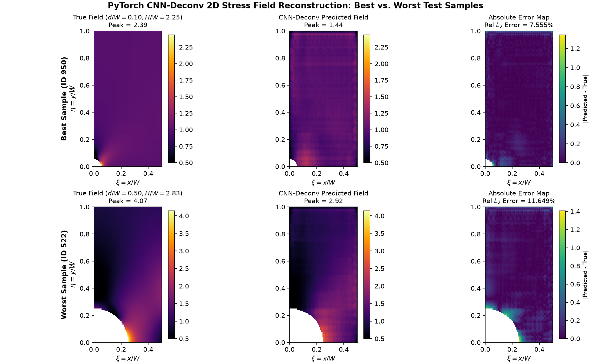

# FEA Surrogate Model: Predicting Stress Concentration from Geometry

Finite element analysis (FEA) is accurate but slow. This project trains machine learning surrogates on FEA results so that the stress concentration of a plate with a hole can be predicted almost instantly, and checks how far those predictions can be trusted, including outside the range the models were trained on.

## Problem

A rectangular plate (width W, height H) with a central circular hole (radius r) is pulled by a uniform tensile stress. The peak von Mises stress occurs at the edge of the hole. The goal is to predict the **stress concentration factor** `Kt = peak stress / applied stress` from the geometry.

## Approach

1. **FEA data generation** (`data_gen/gen_data.py`)
   - Quarter-plate model using symmetry, linear elastic, plane stress, quadratic triangular elements
   - scikit-fem for the solver, gmsh for meshing (refined near the hole)
   - 1000 geometries sampled with Latin hypercube sampling (seed 42)
   - Inputs: plate width W, hole diameter over width d/W (0.05 to 0.50), aspect ratio H/W (2 to 3), applied stress
2. **FEA verification**
   - Peak stress compared with Peterson's analytical formula: within about 0.6%
   - Mesh convergence study; 32 elements along the hole arc chosen (change under 1%)
3. **Surrogate models** (`models/baselines.py`)
   - Linear regression, cubic polynomial with ridge, gradient boosting, Gaussian process (ARD), MLP
   - Target is `Kt` rather than raw stress, because the problem is linear and load only scales the answer
   - Split by geometry (one row per simulation) to avoid leakage

## Results

Interpolation (random 70/15/15 split):

| Model | Mean rel. error | Max rel. error |
|---|---|---|
| Linear | 2.6% | 6.8% |
| Poly3 + Ridge | 0.064% | 0.22% |
| Gradient boosting | 0.058% | 0.27% |
| MLP | 0.048% | 0.33% |
| **Gaussian process** | **0.015%** | **0.18%** |

Extrapolation (trained on d/W below 0.40, tested on d/W of 0.45 and above):

| Model | Mean rel. error | Max rel. error |
|---|---|---|
| **Gaussian process** | **0.30%** | **0.58%** |
| Poly3 + Ridge | 0.66% | 1.17% |
| MLP | 3.5% | 6.3% |
| Linear | 9.8% | 12.6% |
| Gradient boosting | 10.3% | 14.1% |

Key findings:

- Gradient boosting is accurate in interpolation but fails in extrapolation, because tree models cannot extend beyond the training range. A random split alone would have hidden this.
- The Gaussian process gave the plate width W a length scale at its upper bound, meaning it learned that W does not matter. This matches the physics, since only the ratios d/W and H/W control the stress concentration.
- Surrogate error is below the FEA's own mesh discretization error (about 0.2 to 0.5%).
- Batched inference is roughly 8,000x faster than a single FEA run (about 0.175 s per run here).




## Stress field prediction

Moving beyond a single scalar stress concentration factor ($K_t$), this stage predicts the complete continuous 2D normalized von Mises stress field ($\sigma_{\text{vm}} / \sigma_{\text{applied}}$) across the plate quarter directly from geometry $(d/W, H/W)$.

### Grid and mask definition
- **Non-dimensional spatial grid:** Finite element fields from `data_gen/gen_fields.py` are resampled onto a fixed Cartesian coordinate grid: $\xi = x/W \in [0, 0.5]$ ($n_\xi = 64$ points) and $\eta = y/W \in [0, 1.0]$ ($n_\eta = 128$ points), giving a resolution of $128 \times 64$ ($8,192$ pixels). Non-dimensionalizing by plate width $W$ ensures all geometries map to identical coordinate bounds with uniform square pixels ($\Delta \xi \approx 0.0079$, $\Delta \eta \approx 0.0079$).
- **Analytic hole masking:** A boolean mask is defined per sample: True for valid plate material ($\xi^2 + \eta^2 \ge (d / (2W))^2$) and False inside the circular hole void. Finite element stresses are never evaluated inside the hole. Boundary pixel rounding fallback uses nearest-node interpolation (0 pixels required fallback across all 1,000 samples).
- **Hole inpainting (POD):** To prevent artificial step discontinuities at the circular void boundary from polluting orthogonal PCA modes, hole pixels are inpainted using nearest-neighbor Euclidean distance transform (`scipy.ndimage.distance_transform_edt`) prior to PCA fitting. The analytic hole mask is reapplied post-reconstruction.
- **Masked loss (PyTorch NN):** The neural network decoder is trained strictly using masked Mean Squared Error ($\mathcal{L} = \frac{1}{\sum M} \sum M \odot (\hat{y} - y)^2$), masking out void pixels during backpropagation.

### Models compared
1. **POD + GP (Reduced-Order Model, `models/field_pod.py`):**
   - Fits PCA on flattened inpainted fields on training data.
   - Evaluated 1 to 20 spatial modes; 20 modes selected (validation reconstruction error $0.17\%$).
   - Trains 20 independent Gaussian Processes with ARD RBF + WhiteKernel (`normalize_y=True`) mapping standardized $(d/W, H/W)$ to mode coefficients.
2. **CNN-Deconv Neural Network (`models/field_nn.py`):**
   - Standardized input $(d/W, H/W) \to$ FC layers ($2 \to 128 \to 256 \to 256 \times 4 \times 8 = 8,192$ units with ReLU).
   - Reshape to $(B, 256, 4, 8)$ feature map $\to$ 4 transposed-convolution stages ($4\times 8 \to 8\times 16 \to 16\times 32 \to 32\times 64 \to 64\times 128$) with ReLU $\to$ bilinear resize to $(128, 64)$.
   - Exactly 2,827,617 trainable parameters. Trained with Adam (initial lr 1e-3, cosine decay, batch size 32, early stopping on validation loss).

### Results: POD+GP vs. Neural Network

All numbers below are dynamically sourced directly from the results files in `results/`:

| Split | Model | Mean Rel. $L_2$ Error (%) | Max Rel. $L_2$ Error (%) | Mean Abs. Pixel Error | Mean Peak Error (%) | Max Peak Error (%) | Single-Sample Latency | Batched Latency (per sample) | Speedup vs FEA (Single) | Speedup vs FEA (Batched) | Source File |
|---|---|:---:|:---:|:---:|:---:|:---:|:---:|:---:|:---:|:---:|---|
| **Interp** | **POD + GP (20 modes)** | **5.29%** | **10.37%** | **0.0224** | **19.83%** | **33.25%** | 7,916.1 $\mu$s (7.92 ms) | **839.4 $\mu$s (0.84 ms)** | **22.1x** | **208.4x** | `results/pod_results.csv` |
| **Interp** | **CNN-Deconv NN** | 8.78% | 11.65% | 0.0504 | 39.56% | 51.01% | **6,587.1 $\mu$s (6.59 ms)** | 1,781.7 $\mu$s (1.78 ms) | **26.6x** | **98.2x** | `results/nn_results.csv` |
| **Extrap** | **POD + GP (20 modes)** | **28.17%** | **30.86%** | **0.2364** | 66.23% | 68.64% | 17,323.6 $\mu$s (17.32 ms) | **1,138.2 $\mu$s (1.14 ms)** | **10.1x** | **153.7x** | `results/pod_results.csv` |
| **Extrap** | **CNN-Deconv NN** | 33.86% | 40.99% | 0.3732 | **31.44%** | **36.48%** | **6,816.3 $\mu$s (6.82 ms)** | 1,686.5 $\mu$s (1.69 ms) | **25.7x** | **103.7x** | `results/nn_results.csv` |

*Reference FEA baseline:* Mean runtime of 174.98 ms ($174,976.2\ \mu\text{s}$) per simulation ($51.80\text{ ms}$ meshing + $123.18\text{ ms}$ solving), computed from `data/plate_hole.csv` (1,000 successful runs) and compiled in `results/field_comparison.csv`.

### Comparison figures


*Figure 1: Mean per-sample relative $L_2$ error on valid plate pixels for POD+GP vs. CNN-Deconv NN across both splits (`results/field_comparison_bars.png`).*


*Figure 2: Relative $L_2$ field error versus hole diameter ratio $d/W$ on the extrapolation test set ($d/W \ge 0.45$) showing individual test samples and polynomial trends (`results/field_extrapolation_vs_d_over_W.png`).*


*Figure 3: Best and worst test sample reconstructions for POD+GP (`results/pod_best_worst.png`).*


*Figure 4: Best and worst test sample reconstructions for CNN-Deconv NN (`results/nn_best_worst.png`).*

### Field prediction limitations
- **Boundary stair-stepping:** The structured $128 \times 64$ Cartesian grid introduces slight geometric discretization error along the circular hole boundary compared to body-fitted triangular FEA meshes.
- **Smoothing of peak stress concentrations:** While relative field $L_2$ errors in interpolation are modest ($5.29\%$ for POD+GP and $8.78\%$ for NN), localized peak stress errors are higher ($19.83\%$ and $39.56\%$). Both models act as spatial smoothers and tend to underpredict sharp boundary stress gradients.
- **Severe extrapolation degradation:** For $d/W \ge 0.45$, relative field error jumps to $28.17\%$ (POD) and $33.86\%$ (NN). Near $d/W \to 0.50$, the net section ligament narrows dramatically, causing severe non-linear stress redistribution that cannot be reliably extrapolated from training geometries where $d/W < 0.40$.
- **Field latency overhead:** Predicting an $8,192$-point field requires $0.8\text{--}1.8\text{ ms}$ (batched) and $6.5\text{--}17.3\text{ ms}$ (single-sample), which is $\sim 100\text{--}200\times$ faster than FEA. By contrast, scalar models predicting $K_t$ directly run in $\sim 5\ \mu\text{s}$ ($\sim 28,000\times$ faster than FEA).

## Project structure

```
data_gen/gen_data.py          FEA data generation and verification
data_gen/gen_fields.py        Resample FEA stress fields onto fixed Cartesian grid
models/baselines.py           Baseline scalar surrogate models and evaluation
models/field_pod.py           POD + Gaussian Process field surrogate
models/field_nn.py            PyTorch CNN-Deconv field surrogate
models/compare_fields.py      Comparison of field surrogates, baselines, and FEA
results/plot_field_samples.py Visualize example masked stress fields
data/plate_hole.csv           Generated tabular FEA dataset (1000 runs)
data/fields.npz               Resampled 2D stress fields and geometry masks
results/                      Result tables, prediction archives, and comparison plots
decisions.md                  Design decisions and reasoning
requirements.txt              Python dependencies
```

## How to run

```bash
python -m venv venv
venv\Scripts\activate
pip install -r requirements.txt

# 1. Scalar FEA and baseline surrogates
python data_gen/gen_data.py --verify
python data_gen/gen_data.py --n 1000 --n_hole 32 --out data/plate_hole.csv
python models/baselines.py

# 2. 2D Stress field generation and surrogates
python data_gen/gen_fields.py
python results/plot_field_samples.py
python models/field_pod.py
python models/field_nn.py
python models/compare_fields.py
```

## Limitations

- Valid only within the sampled parameter ranges and for this one geometry family.
- Inherits any error from the FEA used to create the labels.
- 2D linear FEA is already cheap, so the speedup is real but modest; the payoff grows for 3D, nonlinear or CFD problems.
- Does not replace final FEA verification for safety-critical designs.

## Next steps

- Physics-informed neural operators (FNO, DeepONet) for mesh-free field prediction
- Uncertainty quantification on full fields via ensemble methods
- Topology optimization and inverse design using surrogate gradients

